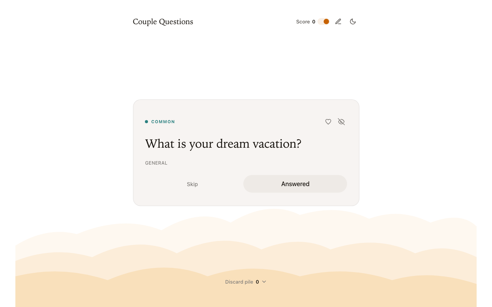
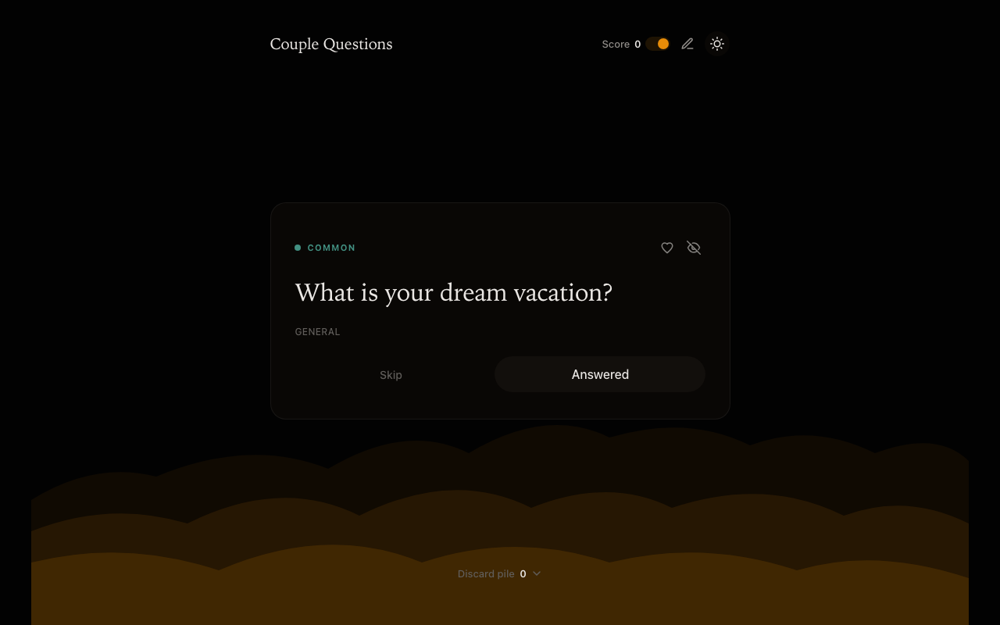
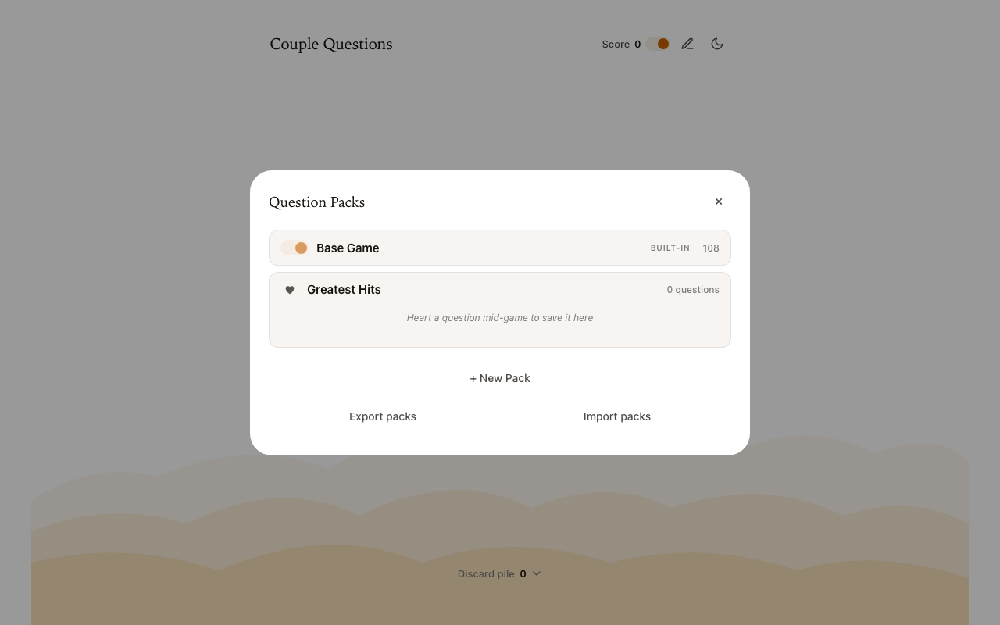
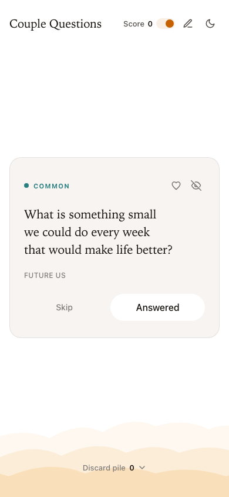

# Couple Questions

A zero-dependency party card game: draw question cards of increasing rarity
and talk. Built with a static frontend (vanilla HTML/CSS/JS) and a Python
stdlib server — no frameworks, no build step, no pip installs.



## Features

- **108 built-in questions** across five rarity tiers (common → mythic),
  with a glow reveal for legendary and mythic draws
- **Custom question packs** — create, edit, enable/disable, export and
  import packs as JSON
- **Greatest hits** — heart a question mid-game and replay your favorites
  as their own round
- **Retire questions** you never want to see again (with undo)
- **Optional score tracking**, discard pile, light/dark theme
- Fully responsive, keyboard-navigable, respects `prefers-reduced-motion`

| Dark mode | Pack manager | Mobile |
|---|---|---|
|  |  |  |

## Run locally

Requires Python 3.9+ — nothing else.

```sh
python3 server.py
# open http://localhost:8080
```

Data files (`question_packs.json`, `user_data.json`) are written next to
`server.py`, or to `$DATA_DIR` if set. Port and bind address are
configurable via `PORT` and `HOST`.

## Deploy with Docker

Build the image and run it with a named volume so packs and favorites
survive container restarts and upgrades:

```sh
docker build -t couple-questions .
docker run -d --name couple-questions \
  -p 8080:8080 \
  -v couple-questions-data:/data \
  --restart unless-stopped \
  couple-questions
```

The game is now at `http://localhost:8080` (or `http://<host-ip>:8080`
from other devices on your network).

### Upgrade to a new version

```sh
docker build -t couple-questions .
docker rm -f couple-questions
docker run -d --name couple-questions -p 8080:8080 \
  -v couple-questions-data:/data --restart unless-stopped couple-questions
```

Your data lives in the `couple-questions-data` volume, so it survives the
container being replaced.

### Move the image to another machine (no registry needed)

```sh
docker save couple-questions | gzip > couple-questions.tar.gz
# copy the file over, then on the target machine:
docker load < couple-questions.tar.gz
docker run -d --name couple-questions -p 8080:8080 \
  -v couple-questions-data:/data --restart unless-stopped couple-questions
```

## Tests

```sh
python3 -m unittest test_server.py
```

## Project layout

| File | Purpose |
|---|---|
| `index.html`, `style.css`, `app.js` | Frontend (vanilla, no build step) |
| `questions.json` | The 108 built-in questions |
| `server.py` | Python stdlib server: static files + pack/marks API |
| `test_server.py` | API test suite (`unittest`) |
| `Dockerfile` | Container image (`python:3.12-slim`) |
